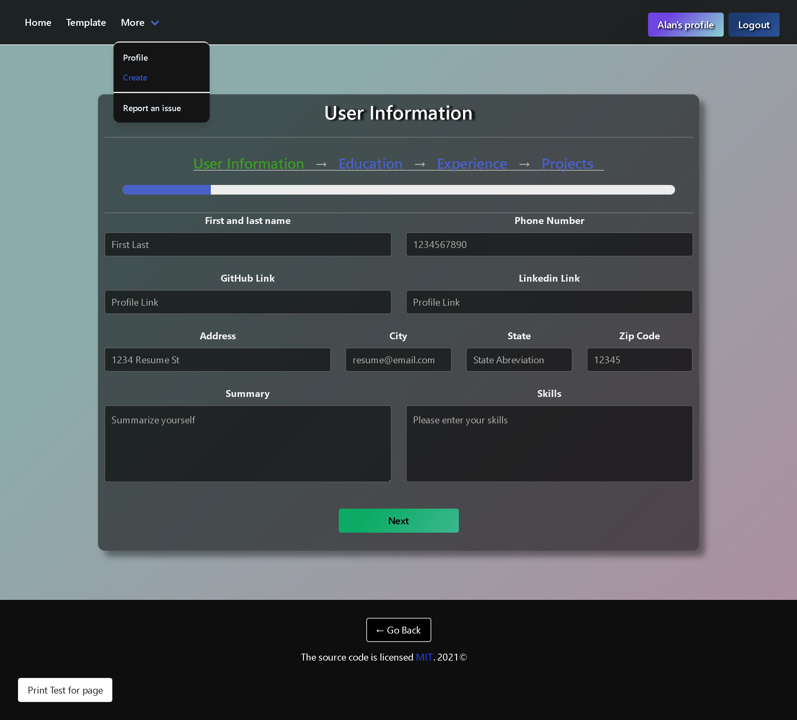
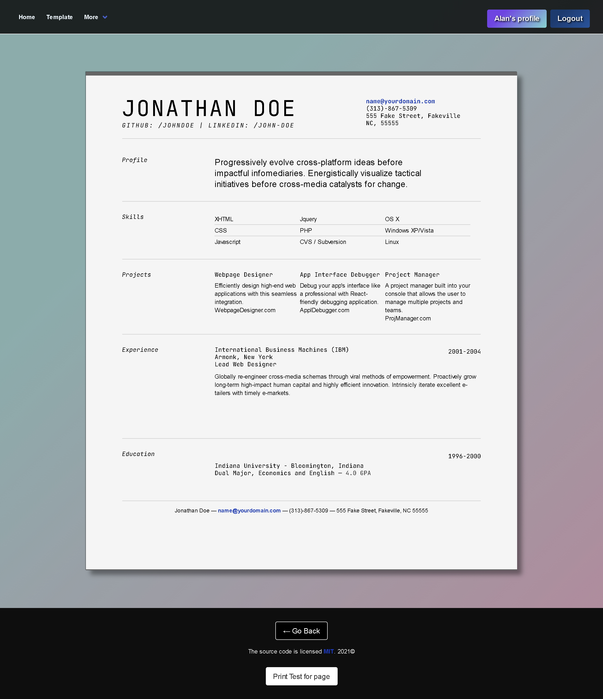

# Rapid Résumé

## Contents
1. [About](#About)
2. [Description](#Description)
3. [Screen-Shots](#Screen-Shots)
4. [Contact-Info](#Contact-Info)
5. [License](#License)

## About
[Deployed Application](https://rapid-resume.herokuapp.com/)
Rapid Résumé is a website that allows users to sign up for an account and create a resume based on their information tailored to the web development sector. The user can then download a virtual copy of their resume to send out to potential employers or print out a hardcopy for their interviews.

## Description
The techonologies used in this application include react.js, bulma framework, apollo server, graphql, node.js, animation.css, yui framework, mongodb, mongoose, express server, and jspdf. When signing up for an account, the user's credentials are checked through authentication to meet certain requirements. Once logged in, the user may enter in specific information on the resume build pages. Once all info is entered and put into the mongoDB user table, that info is entered into the chosen résumé template. There, the user may print off a copy or download it as a file using the jspdf.

## Screen-Shots

## Contact-Info
Alan Gaudet - <alanmgaudet@gmail.com> <https://github.com/amgaudet>

Andrew Bianco - <andrewbianco98@gmail.com>  <https://github.com/morrisbianco>

Josh Crane - <Jdogcrane@gmail.com>  <https://github.com/Jdogcrane>

Ryan Paynter - <ryanpaynt@outlook.com>  <https://github.com/ryanpaynt>

## License
MIT License

Copyright (c) 2021 Alan Gaudet

Permission is hereby granted, free of charge, to any person obtaining a copy
of this software and associated documentation files (the "Software"), to deal
in the Software without restriction, including without limitation the rights
to use, copy, modify, merge, publish, distribute, sublicense, and/or sell
copies of the Software, and to permit persons to whom the Software is
furnished to do so, subject to the following conditions:

The above copyright notice and this permission notice shall be included in all
copies or substantial portions of the Software.

THE SOFTWARE IS PROVIDED "AS IS", WITHOUT WARRANTY OF ANY KIND, EXPRESS OR
IMPLIED, INCLUDING BUT NOT LIMITED TO THE WARRANTIES OF MERCHANTABILITY,
FITNESS FOR A PARTICULAR PURPOSE AND NONINFRINGEMENT. IN NO EVENT SHALL THE
AUTHORS OR COPYRIGHT HOLDERS BE LIABLE FOR ANY CLAIM, DAMAGES OR OTHER
LIABILITY, WHETHER IN AN ACTION OF CONTRACT, TORT OR OTHERWISE, ARISING FROM,
OUT OF OR IN CONNECTION WITH THE SOFTWARE OR THE USE OR OTHER DEALINGS IN THE
SOFTWARE.
